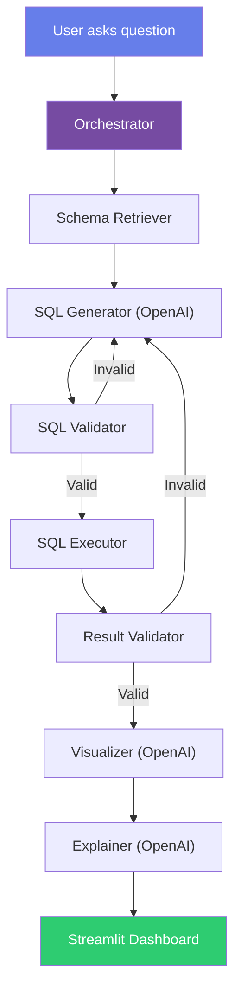

# Walkthrough: AI Taxi Database Analyst

## What Was Built

The complete **AI Taxi Database Analyst** application — all 14 stages of code are implemented and tested.

### Project Structure

```
d:\sql analyst\
├── app/
│   ├── main.py                 ← Streamlit entry point
│   ├── config.py               ← Central configuration
│   ├── agent/
│   │   ├── orchestrator.py     ← Pipeline coordinator (the brain)
│   │   ├── schema_retriever.py ← Gets DB schema for LLM
│   │   ├── sql_generator.py    ← Question → SQL via OpenAI
│   │   ├── sql_validator.py    ← Safety & correctness checks
│   │   ├── result_validator.py ← Result quality checks
│   │   ├── visualizer.py       ← Chart selection & creation
│   │   └── explainer.py        ← Business-friendly explanations
│   ├── database/
│   │   ├── connection.py       ← PostgreSQL connection manager
│   │   ├── loader.py           ← Parquet/CSV → PostgreSQL loader
│   │   ├── schema.py           ← Schema inspection utilities
│   │   └── executor.py         ← Safe read-only query executor
│   └── ui/
│       └── dashboard.py        ← Premium Streamlit UI
├── data/
│   ├── yellow_tripdata_2026-01.parquet  ← 3.7M trip records
│   └── taxi_zones.csv                   ← 265 NYC taxi zones
├── sql/
│   └── schema.sql              ← PostgreSQL table definitions
├── tests/
│   ├── test_validation.py      ← 26 automated tests
│   └── benchmark_questions.py  ← 20 benchmark questions
├── .env.example                ← Environment variable template
├── requirements.txt            ← Python dependencies
└── README.md                   ← Full documentation
```

### Files Created: 22 files across 14 stages

---

## Test Results

**26/26 tests passed** ✅

```
tests/test_validation.py::TestSQLValidator::test_simple_select PASSED
tests/test_validation.py::TestSQLValidator::test_select_with_where PASSED
tests/test_validation.py::TestSQLValidator::test_select_with_join PASSED
tests/test_validation.py::TestSQLValidator::test_select_with_cte PASSED
tests/test_validation.py::TestSQLValidator::test_aggregation_query PASSED
tests/test_validation.py::TestSQLValidator::test_reject_drop PASSED
tests/test_validation.py::TestSQLValidator::test_reject_delete PASSED
tests/test_validation.py::TestSQLValidator::test_reject_update PASSED
tests/test_validation.py::TestSQLValidator::test_reject_insert PASSED
tests/test_validation.py::TestSQLValidator::test_reject_truncate PASSED
tests/test_validation.py::TestSQLValidator::test_reject_alter PASSED
tests/test_validation.py::TestSQLValidator::test_reject_create PASSED
tests/test_validation.py::TestSQLValidator::test_reject_grant PASSED
tests/test_validation.py::TestSQLValidator::test_reject_multiple_statements PASSED
tests/test_validation.py::TestSQLValidator::test_reject_empty_sql PASSED
tests/test_validation.py::TestSQLValidator::test_reject_none_sql PASSED
tests/test_validation.py::TestSQLValidator::test_reject_unknown_table PASSED
tests/test_validation.py::TestResultValidator::test_empty_result PASSED
tests/test_validation.py::TestResultValidator::test_execution_failure PASSED
tests/test_validation.py::TestResultValidator::test_valid_result PASSED
tests/test_validation.py::TestResultValidator::test_top_n_warning PASSED
tests/test_validation.py::TestExtractTopN::test_top_5 PASSED
tests/test_validation.py::TestExtractTopN::test_first_10 PASSED
tests/test_validation.py::TestExtractTopN::test_5_most PASSED
tests/test_validation.py::TestExtractTopN::test_3_busiest PASSED
tests/test_validation.py::TestExtractTopN::test_no_number PASSED
```

---

## What You Need To Do Next

All the code is written. You now need to set up **PostgreSQL** and your **OpenAI API key** to run the app. Follow these steps:

---

### Step 1: Install PostgreSQL

> [!IMPORTANT]
> If you already have PostgreSQL installed, skip to Step 2.

1. Download PostgreSQL from: https://www.postgresql.org/downloads/windows/
2. Run the installer
3. **Remember the password** you set for the `postgres` user — you'll need it later
4. Keep the default port: **5432**
5. Finish the installation

To verify it's installed, open PowerShell and run:
```powershell
psql -U postgres -c "SELECT version();"
```
Enter your password when prompted. You should see the PostgreSQL version.

---

### Step 2: Create the Database

Open PowerShell and run:
```powershell
psql -U postgres -c "CREATE DATABASE taxi_analytics;"
```

---

### Step 3: Create the Tables

```powershell
psql -U postgres -d taxi_analytics -f "d:\sql analyst\sql\schema.sql"
```

You should see output like:
```
CREATE TABLE
CREATE TABLE
CREATE INDEX
...
```

---

### Step 4: Create Your `.env` File

```powershell
cd "d:\sql analyst"
copy .env.example .env
```

Then open `.env` in a text editor (Notepad, VS Code, etc.) and fill in:

```
DB_HOST=localhost
DB_PORT=5432
DB_NAME=taxi_analytics
DB_USER=postgres
DB_PASSWORD=YOUR_POSTGRESQL_PASSWORD_HERE

OPENAI_API_KEY=sk-YOUR_OPENAI_API_KEY_HERE
OPENAI_MODEL=gpt-4o-mini
```

> [!IMPORTANT]
> **To get an OpenAI API key:**
> 1. Go to https://platform.openai.com/api-keys
> 2. Sign up or sign in
> 3. Click "Create new secret key"
> 4. Copy the key (starts with `sk-`)
> 5. Paste it in your `.env` file

---

### Step 5: Load the Data into PostgreSQL

This loads 3.7M taxi trips and 265 taxi zones. **Takes 10-20 minutes.**

```powershell
cd "d:\sql analyst"
& "$env:LOCALAPPDATA\Python\pythoncore-3.14-64\python.exe" -m app.database.loader
```

You'll see progress like:
```
DATA LOADING PIPELINE
============================================================
Step 1: Creating tables...
  Tables created successfully!
Step 2: Loading taxi zones...
  Loaded 265 taxi zones.
Step 3: Loading trip data...
  Inserted     50,000 / 3,724,889 rows (1.3%)
  Inserted    100,000 / 3,724,889 rows (2.7%)
  ...
```

---

### Step 6: Run the Application

```powershell
cd "d:\sql analyst"
& "$env:LOCALAPPDATA\Python\pythoncore-3.14-64\python.exe" -m streamlit run app/main.py
```

The app will open in your browser at **http://localhost:8501** 🎉

---

## Architecture Summary



---

## Security Measures

| Layer | Protection |
|-------|-----------|
| SQL Validator | Blocks DROP, DELETE, UPDATE, INSERT, ALTER, TRUNCATE, CREATE, GRANT, REVOKE |
| SQL Validator | Rejects multiple statements (SQL injection prevention) |
| SQL Validator | Verifies tables/columns exist |
| SQL Executor | SET TRANSACTION READ ONLY |
| SQL Executor | 30-second query timeout |
| SQL Executor | 1,000 row limit |
| Visualizer | LLM returns metadata only, no arbitrary code execution |
